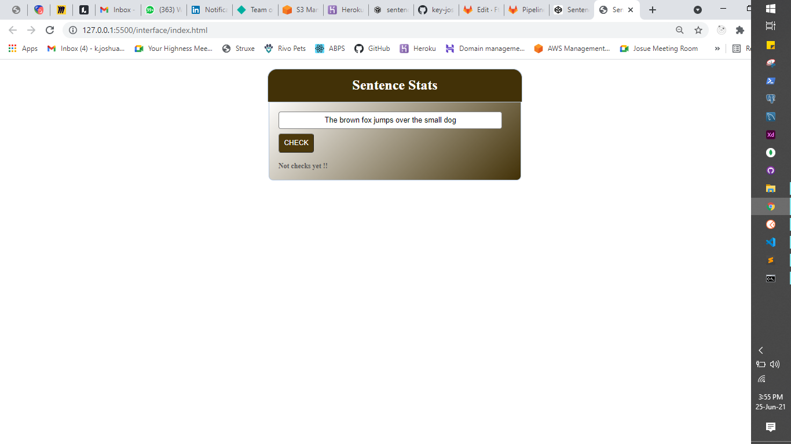

# Sentence-Stats
This is  Function That Receives Sentence Like:  "The brown fox jumps over the small dog"

The Sentence Statistics

Let us write a function that receives a sentence like:
 "The brown fox jumps over the small dog"
 The function should return statistics with the following:
- Number of words
- Number of characters (excluding spaces, commas, exclamation signs, question marks)
- Number of words that have at least one character in common with other words
- Number of words that reversed (case-insensitive) are the same: (Aba => abA)

## DESCRIPTION OF TASK TO BE COMPLETED ?

- During the completion of these tasks I have managed to implement the functionalities to count Number of words, Number of characters and Number of words that reversed.

## HOW SHOULD THIS BE MANUALLY TESTED ?

###  The way this will be tested:

- should clone this repository with ```git clone https://github.com/key-joshua/Sentence-Stats.git```
- Navigate into Project -> interface and then open index.html.

## HOW SHOULD THIS BE AUTOMATICALLY TESTED ?

- Click open link => [codepen](https://codepen.io/key-joshua/pen/GRWVwpd)

## ANY BACKGROUND CONTEXT YOU  WANT TO PROVIDE ?

  - The context is all about pure HTML, CSS and JAVASCRIPT.

## WHAT ARE THE RELEVANT TRACKER STORIES ?

- Click here =>  [codesandbox](https://codesandbox.io/s/sentence-stats-xv59j?file=/src/index.js)

### SCREENSHOTS (IF APPROPRIATE)
#### Captured From Browser




### Any Blocker/Issue

- Logic to implement number of words with common letters